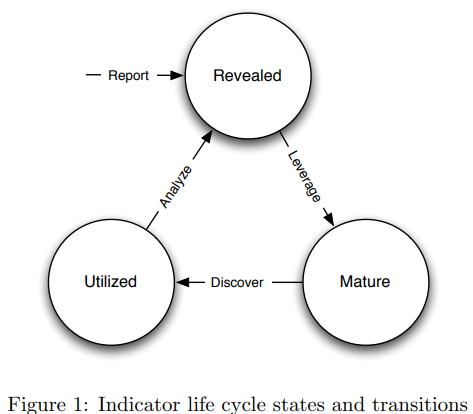
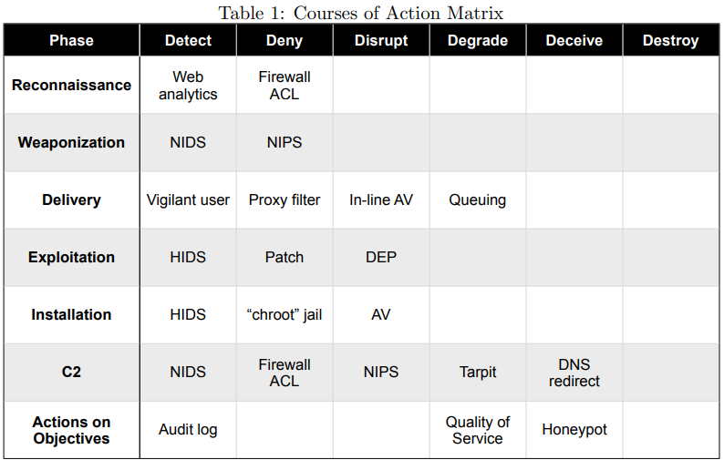
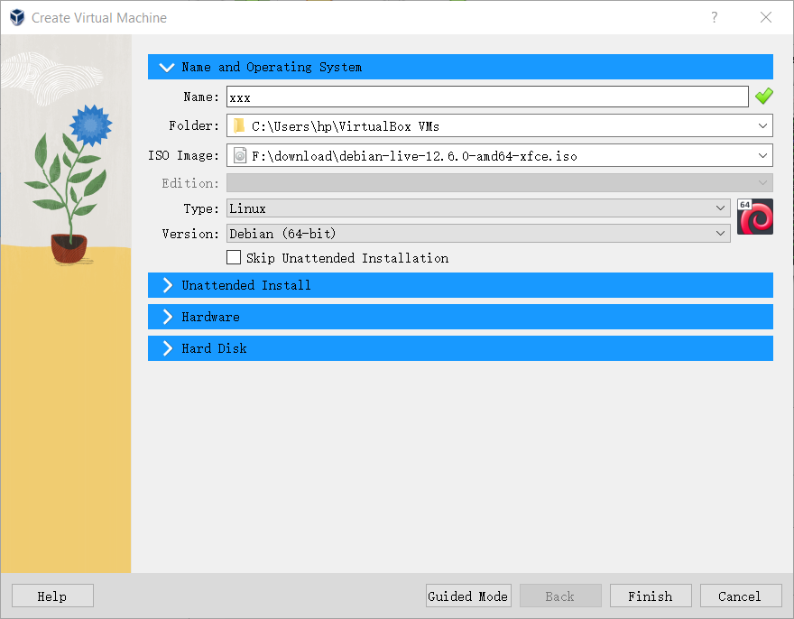
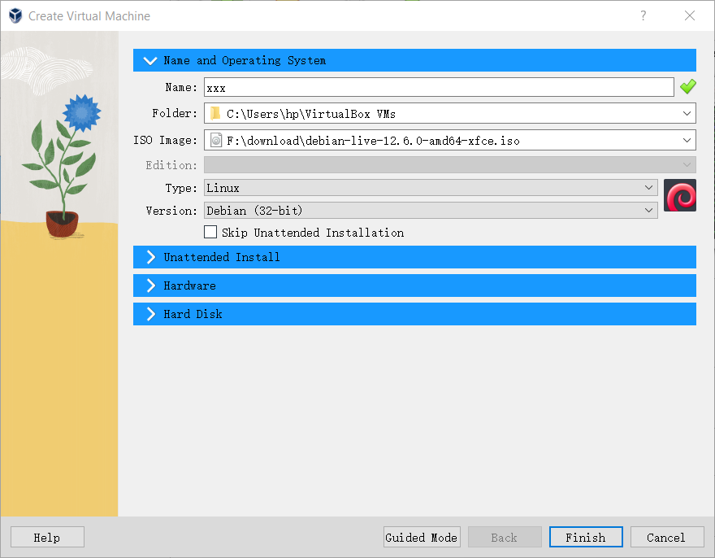
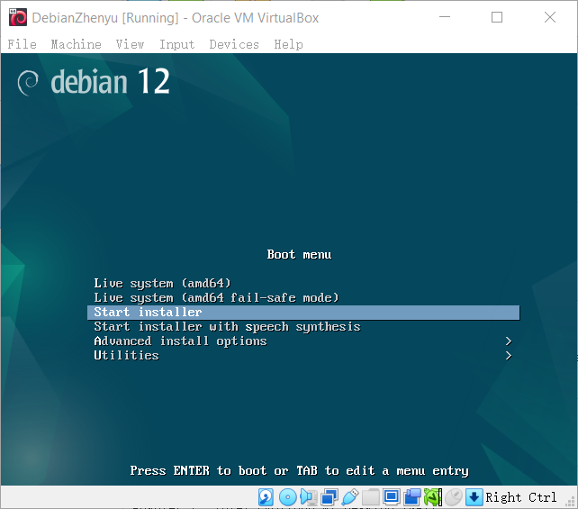
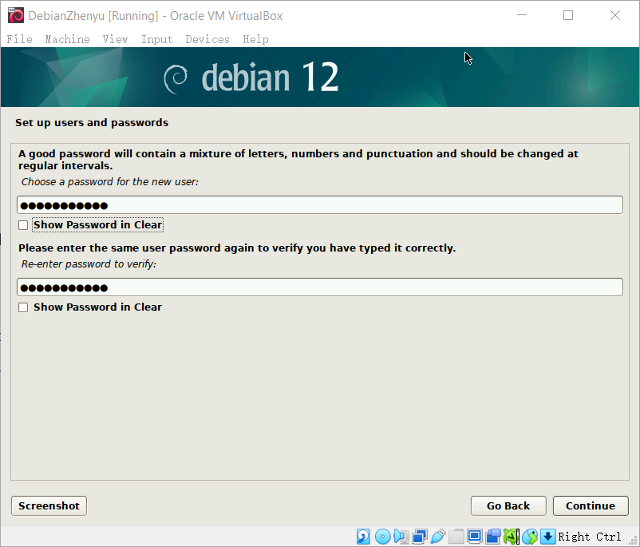
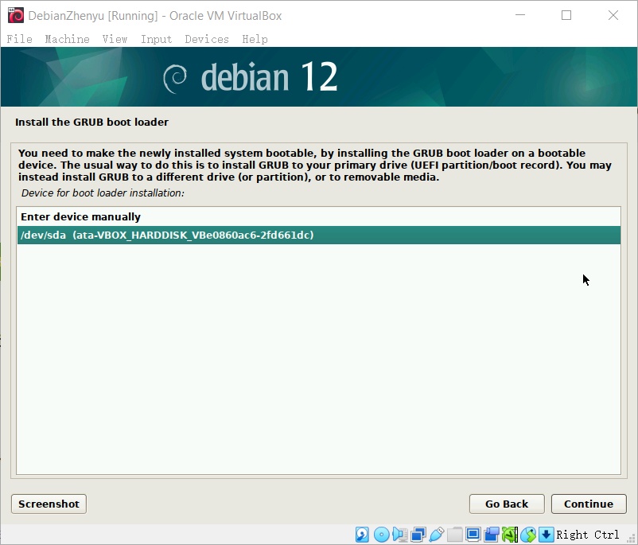
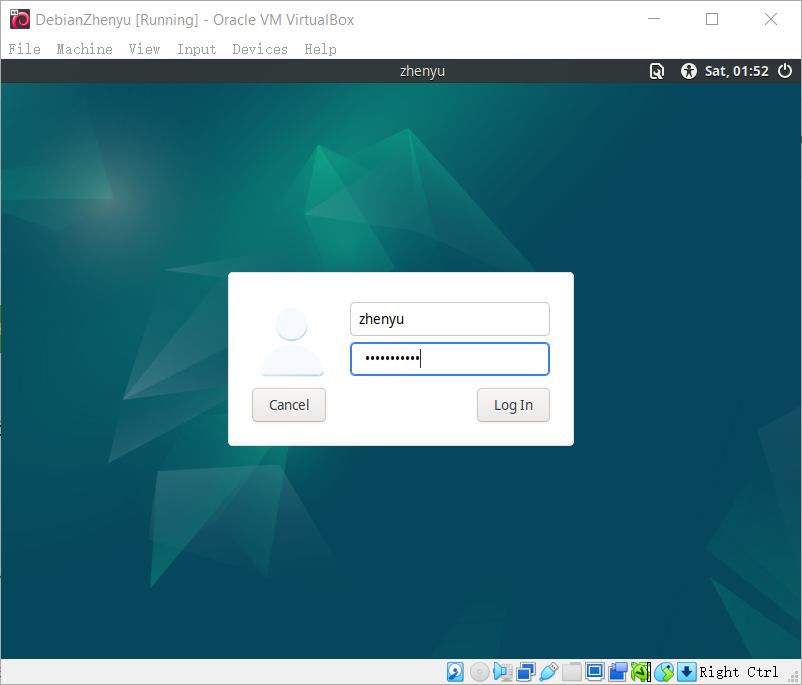

# x read & sumary
# Hutchins et al 2011: Intelligence-Driven Computer Network Defense Informed by Analysis of Adversary Campaigns and Intrusion Kill Chains

## Summary of APTs and the Intelligence-Driven Defense Model

## Overview of Threat Evolution
- Early threats to computer networks were largely automated, like viruses and worms. Advances in anti-virus technology reduced these risks.
- A new class of threats known as **Advanced Persistent Threats (APTs)** has emerged, focusing on data compromise for economic or military gain. APTs involve skilled, targeted attacks, often executed over extended periods.

## Characteristics of APTs
- APTs are manually operated, often evading conventional defenses like firewalls and anti-virus software.
- APT attacks often involve social engineering, customized malware, and zero-day exploits that conventional defenses cannot detect or mitigate.
- Historical examples include targeted intrusions documented by U.S. and U.K. agencies, including attacks on NASA, the U.S. Department of Defense, and other government entities, with the goal of collecting sensitive information.

## Challenges with Conventional Responses
- Traditional incident response methods are inadequate for APTs because they often react only after the compromise and assume the intrusion results from a fixable flaw.
- Conventional security measures such as patching and anti-virus are insufficient because APTs leverage sophisticated, often unknown vulnerabilities.

## Intelligence-Driven Defense Approach
- The intelligence-driven model emphasizes understanding intrusions from the adversary's perspective.
- The **Kill Chain** concept is introduced as a phase-based model that maps the structure of intrusions, guiding defenders on detection, mitigation, and response strategies.
- The kill chain highlights that attackers must succeed at each phase of the chain to achieve their goal, and breaking the chain at any point disrupts the attack.

## Defensive Strategy and Benefits
- By analyzing each phase of the intrusion, defenders can develop more resilient defenses and prioritize investments in security technologies and processes.
- The kill chain model allows for proactive, intelligence-driven responses that increase the adversary's cost and complexity of conducting successful intrusions.
- This approach provides defenders with an advantage over APT-level adversaries by enabling targeted mitigations and response strategies.

## Conclusion
- The paper advocates for an intelligence-driven, threat-focused approach to computer network defense that incorporates detailed intrusion analysis to inform actionable security measures.
- Future studies will continue to refine these models and explore new applications for enhanced cybersecurity resilience against APTs.

# Indicators and the Indicator Life Cycle

**Indicators** are key pieces of information used to describe and detect cyber intrusions. They fall into three main types:

- **Atomic Indicators**: Simple, indivisible data points like IP addresses or email addresses.

- **Computed Indicators**: Derived data such as file hashes or patterns (regular expressions).

- **Behavioral Indicators**: Complex indicators that describe actions, such as specific sequences of events or patterns in network traffic.

## Summary

Indicators help detect and respond to cyber threats by continuously evolving through discovery, refinement, and application. Proper management is crucial to maintain their effectiveness in cybersecurity.




# Intrusion Kill Chain Phases

1. **Reconnaissance**:  
   The attacker researches and identifies potential targets, often by gathering information from public sources like websites and mailing lists.

2. **Weaponization**:  
   The attacker creates a malicious payload, often embedding a remote access trojan (RAT) in common file types like PDFs or Microsoft Office documents.

3. **Delivery**:  
   The attacker transmits the weaponized payload to the target, commonly through email attachments, malicious websites, or USB drives.

4. **Exploitation**:  
   Upon delivery, the payload exploits a vulnerability in the victim's system, such as software bugs or user errors, to activate the malicious code.

5. **Installation**:  
   The attacker installs a backdoor or RAT on the compromised system to maintain persistent access.

6. **Command and Control (C2)**:  
   The compromised system connects to a server controlled by the attacker, allowing them to issue commands and control the system remotely.

7. **Actions on Objectives**:  
   The attacker now executes their primary goal, such as data theft, system disruption, or further lateral movement within the network.
   


# Defensive Strategies

The Intrusion Kill Chain model is valuable for defenders because it maps out the adversary's process, allowing for targeted defenses at each stage. Defenders can implement various strategies such as detection, denial, disruption, degradation, deception, and destruction.

### Examples of Defensive Actions:

- **Detection**:  
  Use systems like Host Intrusion Detection Systems (HIDS) or Network Intrusion Detection Systems (NIDS) to identify malicious activity.

- **Denial**:  
  Implement firewalls or patch vulnerabilities to block attacks.

- **Disruption**:  
  Utilize antivirus software or Data Execution Prevention (DEP) to interrupt the attack process.


# Measuring Effectiveness

The effectiveness of these defensive actions can be measured over time:

- **Track Evolution**: Monitor how responses to different phases of the kill chain have evolved.
- **Identify Gaps**: Use metrics to identify weaknesses and prioritize improvements.
- **Increase Attacker Costs**: A resilient defense forces attackers to invest more resources, making successful intrusions more difficult and costly.

# Conclusion

Understanding and interrupting the entire kill chain, rather than focusing on individual exploits like zero-day attacks, is crucial for building robust cyber defenses. By targeting each stage of the kill chain, defenders can increase the cost and complexity for adversaries, ultimately enhancing their organization's cybersecurity resilience.


# a. Installing Debian 12 (Bookworm) on VirtualBox

## 1. Installing and Configuring VirtualBox

### 1.1 Download and Install VirtualBox

1. **Download VirtualBox**:
   - Visit the [VirtualBox official website](https://www.virtualbox.org/).
   - Navigate to the “Downloads” section.
   - Select the appropriate version for your host OS (Windows/Mac/Linux).

2. **Install VirtualBox**:
   - Run the downloaded installer (`VirtualBox-7.x.x-win.exe` for Windows).
   - Follow the prompts:
     - Click “Next” through the initial setup screens.
     - Choose default features and directories.
     - Click “Yes” when prompted about network interfaces.
     - Complete the installation by clicking “Install” and then “Finish”.

### 1.2 Configure VirtualBox for the First Time

1. **Launch VirtualBox**:
   - Open VirtualBox from the start menu or desktop shortcut.

2. **Update VirtualBox (Optional)**:
   - Check for updates from the Help menu by selecting “Check for Updates”.
   - Download and install updates if available.

## 2. Downloading Debian 12 (Bookworm) ISO

### 2.1 Download the ISO File

1. **Visit the Debian Website**:
   - Go to the [Debian Official Website](https://www.debian.org/).
   - Click on “Getting Debian” and select the “Download a small installation image” option.
   - Choose the AMD64 architecture for 64-bit systems and download the “netinst” ISO file (about 300 MB).

## 3. Setting Up the Virtual Machine in VirtualBox

### 3.1 Create a New Virtual Machine

1. **Create VM**:
   - Click on “New” in the VirtualBox main window.
   - Enter the following details:
     - **Name**: Debian 12 Bookworm
     - **Machine Folder**: Default location
     - **Type**: Linux
     - **Version**: Debian (64-bit)   // This is important, that if you choose 32-bit will have issue that tell you use a wrong cpu i868

2. **Configure VM Settings**:
   - **Memory Size**: Allocate 4096 MB of RAM (4 GB).
   - **Hard Disk**: Select “Create a virtual hard disk now” and click “Create”.
   - **Hard Disk File Type**: Choose “VDI (VirtualBox Disk Image)” and click “Next”.
   - **Storage on Physical Hard Disk**: Select “Dynamically allocated”.
   - **File Location and Size**: Set to 20 GB and click “Create”.

### 3.2 Configure Virtual Machine Settings

1. **Adjust System Settings**:
   - Select the newly created VM and click “Settings”.
   - Under “System”, check:
     - **Processor Tab**: Allocate 2 CPUs.

2. **Attach Debian ISO**:
   - Go to “Storage” and click on the empty optical drive.
   - Click the disk icon next to “Optical Drive” and select “Choose a disk file”.
   - Navigate to the location where the Debian ISO was downloaded and select it.

3. **Configure Network Settings**:
   - Under the “Network” tab, ensure “Attached to” is set to “NAT” for basic internet access.

## 4. Installing Debian 12 (Bookworm) on VirtualBox

### 4.1 Start the Installation

1. **Start the VM**:
   - Click “Start” to boot the virtual machine from the ISO.

2. **Select Installation Method**:
   - At the boot menu, select “Graphical Install” and press Enter.

### 4.2 Follow the Installer Steps

1. **Language and Location Settings**:
   - **Language**: Select English.
   - **Location**: United States.
   - **Keyboard**: American English.

2. **Configure Network**:
   - Allow DHCP to configure the network automatically.

3. **Set Up User and Passwords**:
   - **Hostname**: Enter `debian-vm`.
   - **Domain Name**: Leave blank (or set your own if required).
   - **Root Password**: Set a secure password for the root user.
   - **User Account**: Enter your name, username, and a strong password.

4. **Partition Disks**:
   - Choose “Guided - use entire disk.”
   - Select the available virtual hard disk.
   - Choose “All files in one partition” (default) and click “Continue.”
   - Finish partitioning and write changes to the disk.

5. **Install Base System**:
   - The installer automatically installs the base system. This may take a few minutes.

6. **Configure Package Manager**:
   - Choose the nearest mirror for downloading additional packages.

7. **Select Software**:
   - Choose “Debian desktop environment” and “standard system utilities.”

8. **Install GRUB Boot Loader**:
   - Select “Yes” to install GRUB and choose the disk `/dev/sda`.

9. **Finish Installation**:
   - The system will prompt you to remove the installation media. This can be ignored as VirtualBox handles this automatically.
   - Click “Continue” to reboot the VM.

## 5. Post-Installation Configuration

### 5.1 First Boot and Initial Login

1. **Log In**:
   - Log in using the user credentials created during installation.

2. **Update the System**:
   - Open the terminal and run the following commands to update the package lists and upgrade the system:
     ```bash
     sudo apt update
     sudo apt upgrade -y
     ```

3. **Install Guest Additions** (Optional but recommended for better performance and usability):
   - Insert Guest Additions CD Image via the VirtualBox Devices menu.
   - Open the terminal and install dependencies:
     ```bash
     sudo apt install build-essential dkms linux-headers-$(uname -r)
     ```
   - Mount the CD and run the installer:
     ```bash
     sudo sh /media/cdrom/VBoxLinuxAdditions.run
     ```

4. **Restart the VM**:
   - Restart the VM to apply changes using:
     ```bash
     sudo reboot
     ```

## 6. Screenshots

1. **VirtualBox Configuration**: Show VM settings.
2. **Debian Installation**: Capture key setup screens like partitioning and user setup.
3. **First Boot**: Show the login screen or terminal.

---

By following these steps, you should be able to install Debian 12 (Bookworm) on VirtualBox successfully. If any issues arise, refer to the VirtualBox or Debian documentation for troubleshooting.

